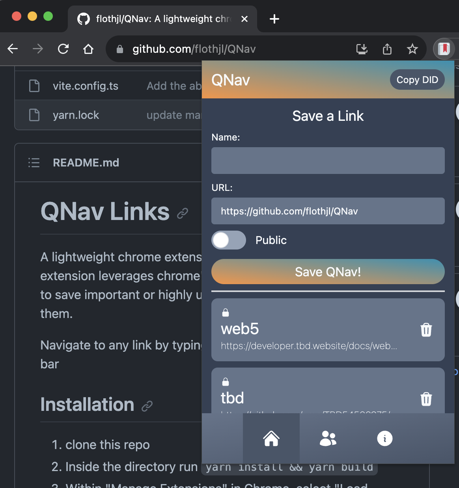
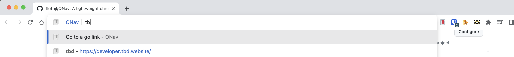

# QNav Links
A lightweight chrome extension for quick navigation. This extension leverages chrome's omnibox feature and allows users to save important or highly used sites and easily navigate to them.

Navigate to any link by typing `go <link name>` in the address bar

## Installation

1. clone this repo
2. Inside the directory run `yarn install && yarn build`
3. Within "Manage Extensions" in Chrome, select "Load Unpacked" and select the `dist` directory within this project

